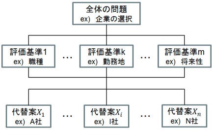
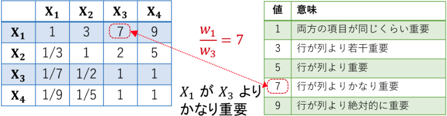
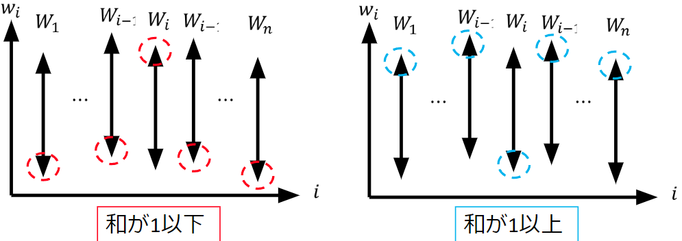
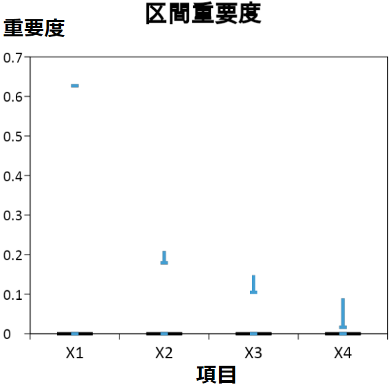
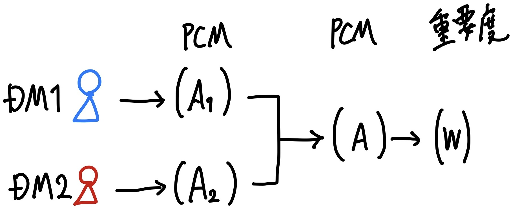
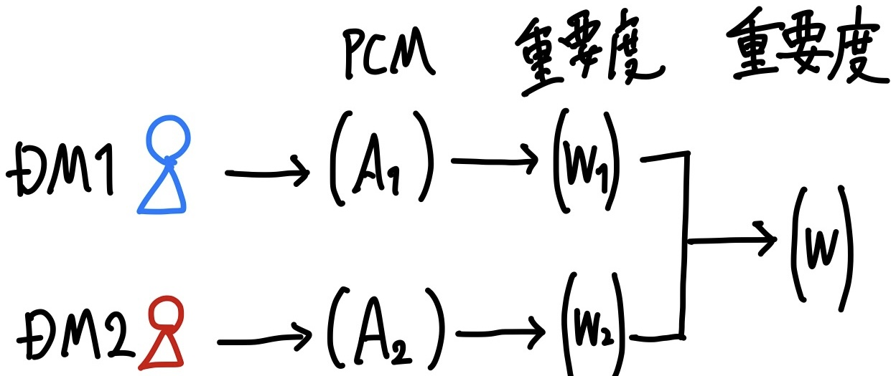
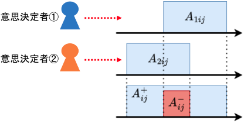
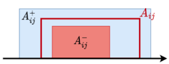
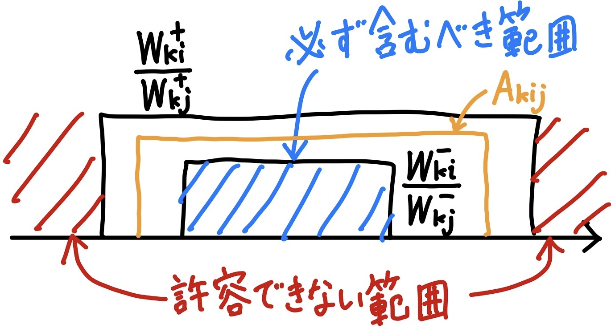
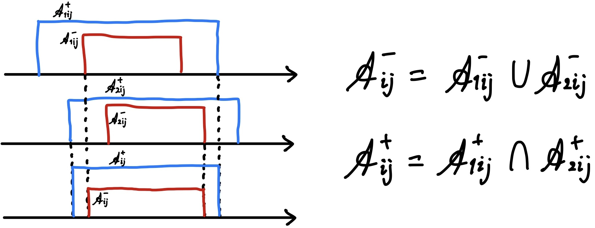

<!-- _class: title -->

# 研究紹介
  
石川 健太郎
2024 年 6 月 4 日

---

# AHP

AHP (Analytic Hierarchy Process) は
多基準意思決定 (Multi-Criteria Decision-Making) 問題を扱うための手法.

複数の基準のもとで代替案選択（順位付け）を行う.

---

# AHP

AHP の基本的な手順は以下の通り.

1. 問題の階層化
2. 一対比較による評価
3. 重要度の推定

## 一対比較による評価

意思決定者の基準/代替案間の一対比較から PCM (Pairwise-Comparison Matrix) を得る.

---

# AHP：重要度の推定

PCM $A = ( a_{ij} )_{n \times n}$ の不整合を誤差とみなして, 誤差を最小化するように重要度 $W = ( w_i )_n$を求める.

## 固有値法

$$
A W = \lambda_\mathrm{max} W
$$

## 幾何平均法

$$
w_i = \frac{\left( \prod_{j=1}^n a_{ij} \right)^\frac{1}{n}}{\sum_{k=1}^n \left( \prod_{j=1}^n a_{kj} \right)^\frac{1}{n}},
\quad i = 1, 2, \ldots, n
$$

---

# AHP：整合性指標

いずれも PCM が整合しているほど小さく, 完全に整合しているときは 0 となる.

## CI (Consistency Index)

$$
\operatorname{CI} = \frac{\lambda_\mathrm{max} - n}{n - 1}
$$

## CR (Consistency Ratio)

CI は $n$ が大きくなるほど大きくなりやすい.
$n$ に対応する定数で割ることで CI に補正をかけたもの.

$$
\operatorname{CR} = \frac{\operatorname{CI}}{\operatorname{RI}(n)}
$$

|          $n$           | $4$    | $5$    | $6$    | $7$    | $8$    | $9$    | $10$   |
| :--------------------: | ------ | ------ | ------ | ------ | ------ | ------ | ------ |
| $\operatorname{RI}(n)$ | $0.90$ | $1.12$ | $1.24$ | $1.32$ | $1.41$ | $1.45$ | $1.49$ |

---

# AHP：整合性指標

## GCI (Geometric Consistency Index)

$$
\operatorname{GCI} = \frac{1}{(n-1)(n-2)} \sum_{i < j} \left( \ln \left( a_{ij} \frac{w_j}{w_i} \right) \right)^2
$$

通常の平均でないことに注意: $(n-1)(n-2) = n(n-1)/2 - (n-1)$

---

# 区間

下限が正の区間 $A = \left[ a^\mathrm{L}, a^\mathrm{U} \right], B = \left[ b^\mathrm{L}, b^\mathrm{U} \right], (a^\mathrm{L} > 0)$ と $\lambda > 0$ に対して次のような演算が定義できる.

- $A + B = \left[ a^\mathrm{L} + b^\mathrm{L}, a^\mathrm{U} + b^\mathrm{U} \right]$
- $A - B = \left[ a^\mathrm{L} - b^\mathrm{U}, a^\mathrm{U} - b^\mathrm{L} \right]$
- $AB = \left[ a^\mathrm{L} b^\mathrm{L}, a^\mathrm{U} b^\mathrm{U} \right]$
- $A^{-1} = \left[ \frac{1}{a^\mathrm{U}}, \frac{1}{a^\mathrm{L}} \right] ~~ \left( \frac{A}{B} = \left[ \frac{a^\mathrm{L}}{b^\mathrm{U}}, \frac{a^\mathrm{U}}{b^\mathrm{L}} \right] \right)$
- $\lambda A = \left[ \lambda a^\mathrm{L}, \lambda a^\mathrm{U} \right]$

$A, B$ が一般の区間の場合, 次のようになる.

$$
AB = \left[ \min\left( a^\mathrm{L} b^\mathrm{L}, a^\mathrm{L} b^\mathrm{U}, a^\mathrm{U} b^\mathrm{L}, a^\mathrm{U} b^\mathrm{U} \right), \max\left( a^\mathrm{L} b^\mathrm{L}, a^\mathrm{L} b^\mathrm{U}, a^\mathrm{U} b^\mathrm{L}, a^\mathrm{U} b^\mathrm{U} \right) \right]
$$

$$
A^{-1} = \left[ \min \left( \frac{1}{a^\mathrm{U}}, \frac{1}{a^\mathrm{L}} \right), \max \left( \frac{1}{a^\mathrm{L}}, \frac{1}{a^\mathrm{U}} \right) \right]
$$

---

# 区間 AHP (Crisp PCM)

crisp PCM から crisp 重要度ベクトルを求める場合には, PCM の不整合性を誤差とみなして, 誤差を最小化するように重要度を求める.

ここでは crisp PCM から区間重要度ベクトルを求める.
PCM の不整合性は区間の幅として表現される.

crisp PCM $A = ( a_{ij} )_{n \times n}$ から区間重要度ベクトル $W = ( W_i )_n = ( [w_i^\mathrm{L}, w_i^\mathrm{U}] )_n$ を求める.

## 区間重要度ベクトルが満たすべき制約

一対比較値 $a_{ij}$ が区間重要度ベクトルの成分間の比 $W_i / W_j$ に含まれるように $W$ を求める.

$$
\begin{align*}
& a_{ij} \in \frac{W_i}{W_j} = \frac{\left[ w_i^\mathrm{L}, w_i^\mathrm{U} \right]}{\left[ w_j^\mathrm{L}, w_j^\mathrm{U} \right]} = \left[ \frac{w_i^\mathrm{L}}{w_j^\mathrm{U}}, \frac{w_i^\mathrm{U}}{w_j^\mathrm{L}} \right],
\quad i, j \in N \\
\Longleftrightarrow ~~ & 
\frac{w_i^\mathrm{L}}{w_j^\mathrm{U}} \leq a_{ij} \leq \frac{w_i^\mathrm{U}}{w_j^\mathrm{L}},
\quad i, j \in N \\
\Longleftrightarrow ~~ & 
w_i^\mathrm{L} \leq a_{ij} w_j^\mathrm{U} ~~ \text{and} ~~ a_{ij} w_j^\mathrm{L} \leq w_i^\mathrm{U},
\quad i, j \in N
\end{align*}
$$

---

# 区間 AHP (Crisp PCM)

## 正規性

区間重要度ベクトル $W$ の正規性は次のように定義される.

$$
\text{任意の } i \in N, ~ w_i \in W_i \text{ に対して } \sum_{j \in N} w_j = 1 \text{ を満たす } w_j \in W_j, ~ j \in N \backslash \{i\} \text{ が存在するとき, } W \text{ は正規性をもつ}.
$$

($i$ 番目を固定したとき, 他をうまくとると和が 1 になる)

$W$ が正規性を持つための条件 (正規性条件) は次のように書ける.

$$
\sum_{j \in N \backslash \{i\}} w_j^\mathrm{U} + w_i^\mathrm{L} \geq 1,
~~ \text{and} ~~
\sum_{j \in N \backslash \{i\}} w_j^\mathrm{L} + w_i^\mathrm{U} \leq 1,
\quad i \in N.
$$

---

# 区間 AHP (Crisp PCM)

## 区間重要度ベクトルの計算

区間重要度ベクトル $W = ( [w_i^\mathrm{L}, w_i^\mathrm{U}] )_n$ は次の最適化問題を解くことで求められる.
(Sugihara & Tanaka 2001)

$$
\begin{aligned}
    \text{minimize} ~~ & ~~
    \sum_{i \in N} \left( w_i^\mathrm{U} - w_i^\mathrm{L} \right) \\
    \text{subject to} ~~ & ~~
    w_i^\mathrm{L} \leq a_{ij} w_j^\mathrm{U}, ~~
    a_{ij} w_j^\mathrm{L} \leq w_i^\mathrm{U}, &&
    i, j \in N, ~ i \neq j, \\ & ~~
    \sum_{j \in N \backslash \{i\}} w_j^\mathrm{U} + w_i^\mathrm{L} \geq 1, &&
    i \in N \\ & ~~
    \sum_{j \in N \backslash \{i\}} w_j^\mathrm{L} + w_i^\mathrm{U} \leq 1, &&
    i \in N, \\ & ~~
    w_i^\mathrm{U} \geq w_i^\mathrm{L} \geq \epsilon, &&
    i \in N.
\end{aligned}
$$

$\epsilon$ は微小な正の数.

---

# 区間 AHP (Crisp PCM)

## 区間重要度ベクトルの非唯一性

最適化問題の最適解と同じ重要度の比 ($W_i / W_j$) をもち, 正規性を満たすような区間重要度ベクトル $t W ~ (t > 0, ~ t \neq 1)$ が存在する場合がある.

つまり, 区間重要度ベクトル $W$ に対して次を満たすような $t > 0, ~ t \neq 1$ が存在することがある.

$$
t \left( \sum_{j \in N \backslash \{i\}} w_j^\mathrm{U} + w_i^\mathrm{L} \right) \geq 1, \quad
t \left( \sum_{j \in N \backslash \{i\}} w_j^\mathrm{L} + w_i^\mathrm{U} \right) \leq 1,
\quad i \in N.
$$

先述の最適化問題の解は $\{ t W ~|~ t > 0, ~ t \neq 1, ~ t \left( \sum_{j \in N \backslash \{i\}} w_j^\mathrm{U} + w_i^\mathrm{L} \right) \geq 1, ~ t \left( \sum_{j \in N \backslash \{i\}} w_j^\mathrm{L} + w_i^\mathrm{U} \right) \leq 1, ~ i \in N \}$ の中で最も $t$ が小さいものとなる.
そのような極端な区間重要度ベクトルが最適解になることを防ぐために, 区間の中心総和を $1$ にする制約を追加する.

$$
\sum_{i \in N} \left( w_i^\mathrm{L} + w_i^\mathrm{U} \right) = 2
$$

---

# 区間 AHP (Crisp PCM)

区間の中心総和を $1$ にする制約を追加した最適化問題は次の通り.

$$
\begin{aligned}
    \text{minimize} ~~ & ~~
    \sum_{i \in N} \left( w_i^\mathrm{U} - w_i^\mathrm{L} \right) \\
    \text{subject to} ~~ & ~~
    w_i^\mathrm{L} \leq a_{ij} w_j^\mathrm{U}, ~~
    a_{ij} w_j^\mathrm{L} \leq w_i^\mathrm{U}, &&
    i, j \in N, ~ i \neq j, \\ & ~~
    \sum_{j \in N \backslash \{i\}} w_j^\mathrm{U} + w_i^\mathrm{L} \geq 1, &&
    i \in N \\ & ~~
    \sum_{j \in N \backslash \{i\}} w_j^\mathrm{L} + w_i^\mathrm{U} \leq 1, &&
    i \in N, \\ & ~~
    \sum_{i \in N} \left( w_i^\mathrm{L} + w_i^\mathrm{U} \right) = 2, \\ & ~~
    w_i^\mathrm{U} \geq w_i^\mathrm{L} \geq \epsilon, &&
    i \in N.
\end{aligned}
$$

---

# 区間 AHP (Crisp PCM)

正規性を満たす区間重要度ベクトル $W$ に対して, $t W$ が正規性を満たすような $t$ の範囲 $[t^\mathrm{L}, t^\mathrm{U}]$ を次のように求めることができる.

$$
t^\mathrm{L} = \frac{1}{\min_{i \in N} \left( \sum_{j \in N \backslash \{i\}} w_j^\mathrm{U} + w_i^\mathrm{L} \right)} \\
t^\mathrm{U} = \frac{1}{\max_{i \in N} \left( \sum_{j \in N \backslash \{i\}} w_j^\mathrm{L} + w_i^\mathrm{U} \right)}
$$

---

# 区間 AHP (Crisp PCM)

## 数値例

$$
A = \begin{pmatrix}
    1 & 3 & 5 & 7 \\
    1/3 & 1 & 2 & 2 \\
    1/5 & 1/2 & 1 & 9 \\
    1/7 & 1/2 & 1/9 & 1
\end{pmatrix}
\qquad
W = \begin{pmatrix}
    0.627 \\
    [0.179, 0.209] \\
    [0.105, 0.148] \\
    [0.016, 0.090]
\end{pmatrix}
$$

---

# 区間 AHP (Crisp PCM)

## 区間重要度ベクトルの区間の幅

一対比較で劣る項目ほど, 対応する区間重要度の幅が大きくなりやすい.

$$
W_i = [1, 3], ~~
W_j = \left[ \frac{1}{3}, \frac{1}{2} \right], \\
V_i = [2, 3], ~~
V_j = \left[ \frac{1}{3}, 1 \right].
$$

$W_i/W_j = V_i/V_j = [2, 9]$ だが,
$\mathrm{Width}(W_i) + \mathrm{Width}(W_j) = 13 / 6 > 5 / 3 = \mathrm{Width}(V_i) + \mathrm{Width}(V_j)$.

---

# 区間 AHP (Crisp PCM)

## 偏差最小化法

$$
\begin{aligned}
    \text{minimize} ~~ & ~~
    \sum_{i,j \in N, ~ i \neq j} d_{ij} \\
    \text{subject to} ~~ & ~~
    \sqrt{a_{ij}} w_j^\mathrm{L} + d_{ij} = \sqrt{a_{ji}} w_i^\mathrm{U}, &&
    i, j \in N, ~ i \neq j, \\ & ~~
    \sum_{j \in N \backslash \{i\}} w_j^\mathrm{U} + w_i^\mathrm{L} \geq 1, &&
    i \in N \\ & ~~
    \sum_{j \in N \backslash \{i\}} w_j^\mathrm{L} + w_i^\mathrm{U} \leq 1, &&
    i \in N, \\ & ~~
    \sum_{i \in N} \left( w_i^\mathrm{L} + w_i^\mathrm{U} \right) = 2, \\ & ~~
    d_{ij} \geq 0, && i, j \in N, ~ i \neq j, \\ & ~~
    w_i^\mathrm{U} \geq w_i^\mathrm{L} \geq \epsilon, &&
    i \in N.
\end{aligned}
$$

---

# 区間 AHP (Crisp PCM)

## 偏差最小化法

$w_i^\mathrm{L} / w_i^\mathrm{U} = w_i^\mathrm{U} / w_i^\mathrm{L} = a_{ij}, ~ i, j \in N, ~ i \neq j$ のとき, 次が成り立つ.

$$
\begin{align*}
a_{ij} \frac{w_j^\mathrm{L}}{w_i^\mathrm{U}} & = 1 \\
\frac{\sqrt{a_{ij}} w_j^\mathrm{L}}{\sqrt{a_{ji}} w_i^\mathrm{U}} & = 1 \\
\underset{=: d_{ij}}{\underline{\sqrt{a_{ji}} w_i^\mathrm{U} - \sqrt{a_{ij}} w_j^\mathrm{L}}} & = 0 \\
\end{align*}
$$

$$
\sqrt{a_{ij}} w_j^\mathrm{L} + d_{ij} = \sqrt{a_{ji}} w_i^\mathrm{U}, ~~
d_{ij} \geq 0, ~~
i, j \in N, ~ i \neq j
\\ \qquad \Longrightarrow ~~
w_i^\mathrm{L} \leq a_{ij} w_j^\mathrm{U}, ~~
a_{ij} w_j^\mathrm{L} \leq w_i^\mathrm{U}, ~~
i, j \in N, ~ i \neq j
$$

---

# 区間 AHP (区間 PCM)

一対比較値が区間として与えられる場合を考える.
意思決定者は**考慮すべき**範囲, **許容可能な**範囲を区間として与える.

区間 PCM $A = (A_{ij})_{n \times n} = ([a_{ij}^\mathrm{L}, a_{ij}^\mathrm{U}])_{n \times n}$ から区間重要度ベクトル $W = (W_i)_{n} = ([w_i^\mathrm{L}, w_i^\mathrm{U}])_n$ を求める.

区間 PCM は次を満たす.

$$
A_{ii} = 1, \quad i \in N. \\
a_{ij}^\mathrm{L} = \frac{1}{a_{ji}^\mathrm{U}}, ~~
a_{ij}^\mathrm{U} = \frac{1}{a_{ji}^\mathrm{L}}, ~~
i, j \in N, ~ i \neq j. 
~~ (A_{ij} = 1 / A_{ji})
$$

---

# 区間 AHP (区間 PCM)

## 上近似モデル

次を満たすような区間重要度ベクトル $W$ を求める.

$$
\begin{align*}
    & \frac{W_i}{W_j} \supseteq A_{ij}, 
    && ~~ i, j \in N, ~ i \neq j. \\
    \Longleftrightarrow & ~~
    \left[ \frac{w_i^\mathrm{L}}{w_j^\mathrm{U}}, \frac{w_i^\mathrm{U}}{w_j^\mathrm{L}} \right] \supseteq \left[ a_{ij}^\mathrm{L}, a_{ij}^\mathrm{U} \right], 
    && ~~ i, j \in N, ~ i \neq j. \\
    \Longleftrightarrow & ~~
    w_i^\mathrm{L} \leq a_{ij} w_j^\mathrm{U}, ~~
    a_{ij} w_j^\mathrm{L} \leq w_i^\mathrm{U}, 
    && ~~ i, j \in N, ~ i \neq j.
\end{align*}
$$

---

# 区間 AHP (区間 PCM)

次の最適化問題を解くことで $W_i / W_j \supseteq A_{ij}$ を満たすような $W$ を求める.
(Sugihara & Tanaka 2004)

$$
\begin{aligned}
    \text{minimize} ~~ & ~~
    \sum_{i \in N} \left( w_i^\mathrm{U} - w_i^\mathrm{L} \right) \\
    \text{subject to} ~~ & ~~
    w_i^\mathrm{L} \leq a_{ij}^\mathrm{U} w_j^\mathrm{U}, ~~
    a_{ij}^\mathrm{L} w_j^\mathrm{L} \leq w_i^\mathrm{U}, &&
    i, j \in N, ~ i \neq j, \\ & ~~
    \sum_{j \in N \backslash \{i\}} w_j^\mathrm{U} + w_i^\mathrm{L} \geq 1, &&
    i \in N \\ & ~~
    \sum_{j \in N \backslash \{i\}} w_j^\mathrm{L} + w_i^\mathrm{U} \leq 1, &&
    i \in N, \\ & ~~
    \sum_{i \in N} \left( w_i^\mathrm{L} + w_i^\mathrm{U} \right) = 2, \\ & ~~
    w_i^\mathrm{U} \geq w_i^\mathrm{L} \geq \epsilon, &&
    i \in N.
\end{aligned}
$$

---

# 区間 AHP (区間 PCM)

## 下近似モデル

次の最適化問題を解くことで $W_i / W_j \subseteq A_{ij}$ を満たすような $W$ を求める.
(Sugihara & Tanaka 2004)

$$
\begin{aligned}
    \text{maximize} ~~ & ~~
    \sum_{i \in N} \left( w_i^\mathrm{U} - w_i^\mathrm{L} \right) \\
    \text{subject to} ~~ & ~~
    a_{ij}^\mathrm{L} w_j^\mathrm{U} \leq w_i^\mathrm{L}, ~~
    w_i^\mathrm{U} \leq a_{ij}^\mathrm{U} w_j^\mathrm{L}, &&
    i, j \in N, ~ i \neq j, \\ & ~~
    \sum_{j \in N \backslash \{i\}} w_j^\mathrm{U} + w_i^\mathrm{L} \geq 1, &&
    i \in N \\ & ~~
    \sum_{j \in N \backslash \{i\}} w_j^\mathrm{L} + w_i^\mathrm{U} \leq 1, &&
    i \in N, \\ & ~~
    \sum_{i \in N} \left( w_i^\mathrm{L} + w_i^\mathrm{U} \right) = 2, \\ & ~~
    w_i^\mathrm{U} \geq w_i^\mathrm{L} \geq \epsilon, &&
    i \in N.
\end{aligned}
$$

この最適化問題は必ずしも実行可能ではない.

---

# グループ意思決定の AHP

複数の意思決定者がそれぞれ PCM $A_k = (a_{kij})_{n \times n}$ を与えるような状況を考える.
このとき, 各意思決定者の PCM を統合して最終的に一つの重要度ベクトルを求める.

---

# グループ意思決定の AHP

## crisp PCM を統合する方法

$$
a_{ij} = \left( \prod_{k \in M} a_{kij} \right)^\frac{1}{m}, ~~
i, j \in N, ~ i \neq j,
$$

---

# グループ意思決定の AHP

## crisp 重要度ベクトルを統合する方法

$$
w_i = \frac{\left( \prod_{k \in M} w_{ki} \right)^\frac{1}{m}}{\sum_{j = 1}^n \left( \prod_{k \in M} w_{kj} \right)^\frac{1}{m}}
$$

---

# グループ意思決定の区間 AHP

## 区間 PCM の結合

二人の意思決定者がそれぞれ**区間** PCM を与える.
二人の意見の落とし所として妥当な区間を求める.
各成分の共通部分と和集合をとることによって二重区間 ($\mathscr{A}_{ij}^- \subseteq \mathscr{A}_{ij}^+$ を満たす二つの区間) が得られる.

$$
\mathscr{A}_{ij}^- = A_{1ij} \cap A_{2j} \\
\mathscr{A}_{ij}^+ = A_{1ij} \cup A_{2j}
$$

---

# グループ意思決定の区間 AHP

$\mathscr{A}_{ij}^- \subseteq A_{ij} \subseteq \mathscr{A}_{ij}^+$ となるような区間 $A_{ij}$ を妥当な区間だとみなす.

---

# グループ意思決定の区間 AHP

## 個人の二重区間 重要度ベクトルの計算

crisp PCM の不整合性を区間重要度ベクトルの幅として表すのと同様に, 個人の区間 PCM の不整合性を二重区間重要度ベクトルとして表すことができる.
次を満たすような二重区間重要度ベクトル $W = ((W_{ki}^-, W_{ki}^+))_n$ を求める.

$$
\frac{W_{ki}^-}{W_{kj}^-} \subseteq A_{kij} \subseteq \frac{W_{ki}^+}{W_{kj}^+}, ~~
i, j \in N, ~ i \neq j,
$$

個人が必ず含むべきと考えている範囲 $W_{ki}^-$ と, 許容できない範囲の補集合 $W_{ki}^+$ が得られる.

---

# グループ意思決定の区間 AHP

## 二重区間 PCM の結合

個人の二重区間 PCM $\mathscr{A}_1, \mathscr{A}_2$ を統合して最終的な二重区間 PCM $\mathscr{A}$ を求める.

少なくとも一人が「必ず含むべき」としている範囲は $\mathscr{A}_{ij}^-$ に含まれる. → 和集合
少なくとも一人が「許容できない」範囲は $\mathscr{A}_{ij}^+$ に含まれない. → 共通部分

---

# グループ意思決定の区間 AHP

## 二重区間重要度ベクトルの正規性

二重区間重要度ベクトル $\mathscr{W} = \left( \left( W_i^-, W_i^+ \right) \right) = \left( \left( \left[ w_i^{\mathrm{L}-}, w_i^{\mathrm{U}-} \right], \left[ w_i^{\mathrm{L}+}, w_i^{\mathrm{U}+} \right] \right) \right)$ の正規性を定める.
$W_i^- \subseteq W_i \subseteq W_i^+, ~ i \in N$ を満たす区間重要度ベクトル $W = \left( W_i \right) = \left( \left[ w_i^{\mathrm{L}}, w_i^{\mathrm{U}} \right] \right)$ 全体の集合を $\mathcal{W}$ とする.
任意の区間重要度ベクトル $W \in \mathcal{W}$ が正規性をもつとき, 二重区間重要度ベクトル $\mathscr{W}$ は正規性をもつという.

この定義のもとでの正規性条件は次のようになる.

$$  
\sum_{j \in N \backslash \{i\}} w_j^{\mathrm{U}-} + w_i^{\mathrm{L}+} \geq 1, ~~
\sum_{j \in N \backslash \{i\}} w_j^{\mathrm{L}-} + w_i^{\mathrm{U}+} \leq 1, \quad
i \in N.
$$
